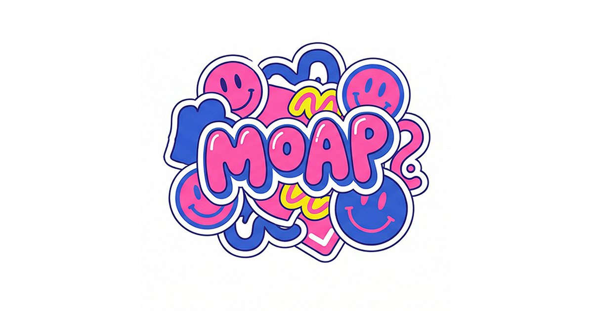

# 🧠 MOAB (모압)
> **MBTI·성격·재미 테스트를 빠르게 즐기고 공유하는 모바일 우선 심리테스트 서비스**
> "가볍게 즐기고, 결과는 손쉽게 공유"

<br/>

## 📖 프로젝트 소개
**MOAB**는 다양한 심리테스트를 한곳에서 제공하는 **콘텐츠형 테스트 플랫폼**입니다.  
테스트 상세 확인부터 진행, 결과 공유까지 한 흐름으로 구성되어 있으며, **검색/추천/공유/OG 이미지 생성** 기능을 포함합니다.

### 📅 프로젝트 기간
2025.12.10 ~ 2026.01.15

<br/>

## 😎 Members

| **이장환** | **천준범** | **손민** |
| :---: | :---: | :---: |
|  |  |  |
| **Full Stack** | **Full Stack** | **Full Stack** |
| dlwkdghks0807@gmail.com | wnsqja2209@gmail.com | dkrhd200197@gmail.com |

<br/>

## ✨ 주요 기능

#### 🏠 홈 & 탐색
- **테스트 큐레이션 섹션**: 인기/최신/카테고리별 테스트를 홈에서 바로 탐색할 수 있습니다.
- **배너 슬라이더**: 주요 테스트를 상단 배너로 노출하여 진입을 유도합니다.
- **검색**: 제목/설명/태그 기반 검색으로 원하는 테스트를 빠르게 찾을 수 있습니다.

#### 📝 테스트 진행 프로세스
- **테스트 상세 페이지**: 예상 소요 시간, 플레이 수, 좋아요 등 주요 정보를 확인할 수 있습니다.
- **진행 UI**: 문항 진행률 바와 선택지 인터랙션을 통해 몰입감 있는 테스트 경험을 제공합니다.
- **결과 계산 로직**: 일반 점수형, MBTI형, 혈액형형 등 테스트 유형별 결과 계산을 지원합니다.

#### 🧩 결과 & 공유 (Core Feature)
- **결과 페이지**: 결과 이미지와 설명, 관련 테스트 추천을 함께 제공합니다.
- **공유 기능**: 카카오톡/Threads/페이스북/링크 복사/Web Share API를 지원합니다.
- **동적 OG 이미지**: 결과 공유 시 `@vercel/og` 기반 동적 이미지를 생성합니다.

#### 🛠️ 개인화 기능
- **좋아요/북마크**: `localStorage` 기반으로 사용자 반응을 저장합니다.
- **다시하기/재진입**: 결과에서 재시작이 가능하며 URL 파라미터로 결과 공유 링크도 동작합니다.

<br/>

## 🌐 서비스 아키텍처


<br/>

## 🛠 Tech Stack

#### Common & Environment
    

#### Frontend
      

#### Backend & Infra
  

#### External APIs / SDK


<br/>

## 🔧 기술적 의사결정 (Technical Decisions)

| 구분 | 기술 스택 | 도입 이유 |
| :--- | :--- | :--- |
| **Framework** | **Next.js 15 (App Router)** | 파일 기반 라우팅으로 테스트 상세/플레이/결과 흐름을 명확히 분리하고, SEO 메타데이터/OG 대응을 단순화하기 위함입니다. |
| **Data Modeling** | **JSON + TypeScript Interface** | 테스트 콘텐츠를 `data/tests/*.json`으로 관리해 비개발자 협업을 쉽게 하고, `types/test.ts`로 런타임 오류를 줄이기 위함입니다. |
| **Result Engine** | **`lib/test-utils.ts` 계산 유틸** | MBTI형/점수형/혈액형형 결과 계산을 공통 모듈로 통합해 중복 로직을 줄이고 유지보수성을 높이기 위함입니다. |
| **Sharing** | **Kakao SDK + Web Share + OG API** | 다양한 공유 채널을 지원하면서 결과 이미지를 동적으로 생성해 공유 전환율을 높이기 위함입니다. |
| **Client Persistence** | **localStorage Custom Hooks** | 로그인 없이도 좋아요/북마크 상태를 유지해 사용자 경험을 가볍게 제공하기 위함입니다. |

<br/>

## 🚨 트러블 슈팅 (Troubleshooting)

### 1. 테스트 데이터 import 형태 불일치 대응 [Data]
- **문제 상황**: 빌드/번들 환경에 따라 테스트 데이터가 배열, 객체, `default` 등 다른 형태로 들어와 데이터 조회 실패 가능성이 있었습니다.
- **해결**: `getAllTests()`에서 배열/객체/`default`/array-like를 모두 방어적으로 처리하도록 구현했습니다.

### 2. Kakao SDK 로딩 타이밍 이슈 [Frontend]
- **문제 상황**: 공유 버튼 클릭 시점에 SDK가 아직 초기화되지 않아 카카오 공유가 실패할 수 있었습니다.
- **해결**: SDK 동적 로드 + 기존 script 재사용 + 초기화 상태 검증(`isInitialized`) + 실패 토스트 처리 로직을 추가했습니다.

### 3. OG 이미지 렌더링 호환성 이슈 [Infra]
- **문제 상황**: 일부 색상 포맷(`oklch`, `lab`)이 OG 렌더러에서 문제를 일으켜 이미지 생성이 불안정할 수 있었습니다.
- **해결**: OG 생성 경로에서 hex/rgb 기반 색상만 사용하고, 폰트/이미지 로드 실패 시 fallback 렌더링을 적용했습니다.

---

### 📂 Folder Structure
```bash
moab
├── app
│   ├── api/og
│   │   ├── result/route.tsx
│   │   └── download/route.tsx
│   ├── search/page.tsx
│   ├── test/[id]/page.tsx
│   ├── test/[id]/play/page.tsx
│   └── test/[id]/result/page.tsx
├── components
│   ├── home
│   ├── layout
│   ├── shared
│   ├── test
│   └── ui
├── data/tests
├── hooks
├── lib
├── public
└── types
```

